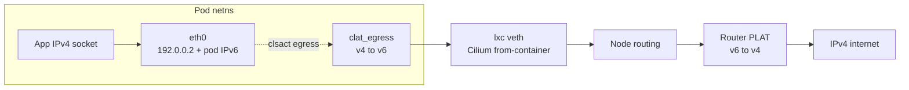
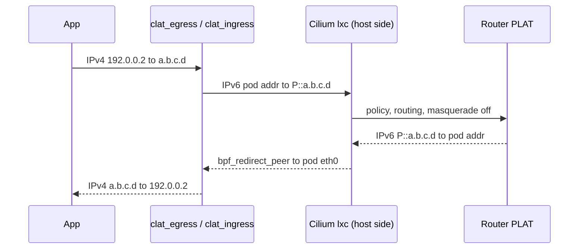

# Design: in-pod eBPF CLAT as a chained Cilium CNI plugin

Sep 25, 2026 · @Andrea Bedini

Status: implemented in this repository. Both BPF programs pass the kernel
verifier, the `BPF_PROG_TEST_RUN` packet suite (24 cases) and the
three-namespace integration test in `hack/netns-test.sh` pass. Sections
below that changed during implementation are marked *(implementation note)*.
Not yet tested under Cilium; see [Test and validation plan](#test-and-validation-plan).

## Context and goals

Decision: replace the per-pod CLAT sidecars with a chained CNI plugin, `cilium-clat`. The plugin attaches a stateless eBPF CLAT (RFC 6877, RFC 7915) to the pod-side `eth0`. Cilium stays unmodified.

The cluster runs Cilium in IPv6-only mode on Talos. Some workloads need IPv4: IPv4 literals, IPv4-only sockets, or software that ignores AAAA records. Today each such pod carries a CLAT sidecar. The sidecars add a container, a daemon, and a privilege (`NET_ADMIN`) to every affected pod.

Goals:

- Every pod gets a working IPv4 stack with no change to its spec.
- No userspace process per pod. The translator lives and dies with the pod network namespace.
- No fork of Cilium and no custom Talos kernel.
- Cilium sees only IPv6 from the endpoint address. Anti-spoofing, identity, and policy keep working.
- Correct ICMP error translation, so PMTUD and traceroute work over IPv4.

## Non-goals

- **No PLAT.** The router keeps the NAT64 function. This design only adds the customer-side translator.
- **No inbound IPv4.** Pods do not accept connections to an IPv4 address. Services stay IPv6.
- **No pod-to-pod IPv4.** Every pod has the same IPv4 address, `192.0.0.2`. IPv4 is for egress to the IPv4 internet only.
- **No upstream Cilium change.** If the design proves out, a Cilium proposal (CFP) is a separate decision.
- **No netkit datapath in phase 1.** Phase 1 supports veth only. See [Interaction with Cilium](#interaction-with-cilium).

## Architecture overview

The system has four components. Only the router PLAT exists today.

| Component | Form | Runs where | Lifetime |
| --- | --- | --- | --- |
| `cilium-clat` CNI plugin | Static Go binary, BPF object embedded with `bpf2go` | Host, called by the container runtime | Per CNI call |
| CLAT BPF programs | `clat_egress`, `clat_ingress` on clsact | Pod netns, pod-side `eth0` | Pod netns |
| Installer | DaemonSet, init container runs `cilium-clat install` (image built with ko, no shell) | Every node | Node |
| PLAT | Stateless or stateful NAT64 | Router | Permanent |



The plugin runs after `cilium-cni` in the chain. It configures the pod netns once and exits. After that, the kernel does all the work. No component on the node needs to stay running for existing pods to keep IPv4.

## Packet flow

The CLAT maps one IPv4 host to the pod's own IPv6 address. Destinations map into the CLAT prefix `P` (see [Address and prefix plan](#address-and-prefix-plan)).

| Direction | Field | Before | After |
| --- | --- | --- | --- |
| Egress (clsact egress, pod `eth0`) | Source | `192.0.0.2` | Pod IPv6 address |
| Egress | Destination | `a.b.c.d` | `P::a.b.c.d` (RFC 6052, /96) |
| Ingress (clsact ingress, pod `eth0`) | Source | `P::a.b.c.d` | `a.b.c.d` |
| Ingress | Destination | Pod IPv6 address | `192.0.0.2` |
| Ingress, ICMPv6 error from a router | Source | Router address, not in `P` | `192.0.0.8` (RFC 7335 dummy) |



Ingress translation matches packets whose destination is the pod address and whose source is inside `P`. All other IPv6 traffic passes untouched. This match rule is the reason `P` must not overlap the DNS64 prefix.

*(implementation note)* One more class of packets is translated: ICMPv6 errors (Destination Unreachable, Packet Too Big, Time Exceeded, Parameter Problem) whose source is a router outside `P` but whose embedded packet is a CLAT flow, that is, from the pod IPv6 address to an address in `P`. Routers put their own address on errors, so without this rule no Packet Too Big would ever reach the IPv4 stack and PMTUD would fail. Following RFC 7915 section 5.2 and RFC 6791, such errors get the RFC 7335 IPv4 dummy address `192.0.0.8` as source (`errorSourceIPv4`). `traceroute -4` therefore shows `192.0.0.8` for every IPv6 hop. Native IPv6 errors, and errors quoting other flows, still pass untouched.

## Address and prefix plan

Recommendation: use a dedicated CLAT prefix `P = 64:ff9b:1::/96` from the RFC 8215 local-use range. Keep `64:ff9b::/96` for DNS64 and the existing tayga PLAT.

| Item | Value | Why |
| --- | --- | --- |
| Pod IPv4 | `192.0.0.2/29` on `eth0` | RFC 7335 IPv4 service continuity prefix. Same value in every pod. |
| IPv4 gateway | `192.0.0.1`, permanent neighbour entry | No ARP responder exists on the Cilium side in IPv6-only mode. |
| CLAT source | Pod IPv6 address | Cilium anti-spoofing drops any other source. |
| CLAT prefix `P` | `64:ff9b:1::/96` | Keeps CLAT return traffic apart from DNS64 traffic. |
| ICMP error source | `192.0.0.8` | RFC 7335 dummy address for errors from routers outside `P`. |
| DNS64 / PLAT prefix | `64:ff9b::/96` (current tayga) | Unchanged. |

### Why `P` must differ from the DNS64 prefix

The CLAT uses the pod address as its source. So do native IPv6 sockets in the same pod. If an app connects over IPv6 to a DNS64 address `64:ff9b::a.b.c.d`, the reply is identical to CLAT return traffic. With a shared prefix, `clat_ingress` translates that reply to IPv4. The kernel finds no IPv4 socket and sends a reset.

| Option | Router change | Cost |
| --- | --- | --- |
| **A. Separate `P` (recommended)** | PLAT also serves `64:ff9b:1::/96` | tayga takes one prefix, so a second tayga instance or a move to Jool NAT64 |
| B. Shared prefix, no DNS64 in cluster | None | Remove `dns64` from CoreDNS. IPv6-only pods without CLAT lose IPv4 reach. |
| C. Shared prefix, flow state in CLAT | None | LRU map of outbound IPv4 flows. More code, map sizing, stateful behaviour. |

### PLAT pool pressure

The tayga dynamic pool gives one IPv4 address to each IPv6 source. Each pod address uses one entry until it times out. Pod churn can exhaust a small pool.

Two mitigations:

- Enable Cilium IPv6 masquerade toward `P`. The PLAT then sees one source per node. Cilium reverses the SNAT before `clat_ingress` runs, so the CLAT match still works.
- Replace tayga with a stateful NAT64 (Jool NAT64) that masquerades to one IPv4 address.

## CNI plugin specification

The plugin is a CNI 1.0 chained plugin. It must run after `cilium-cni` and needs `prevResult`.

### Configuration

```json
{
  "cniVersion": "1.0.0",
  "name": "cilium",
  "plugins": [
    { "type": "cilium-cni" },
    {
      "type": "cilium-clat",
      "clatPrefix": "64:ff9b:1::/96",
      "podIPv4": "192.0.0.2/29",
      "gatewayIPv4": "192.0.0.1",
      "errorSourceIPv4": "192.0.0.8",
      "excludeNamespaces": ["kube-system"],
      "logFile": "/var/log/cilium-clat.log"
    }
  ]
}
```

| Key | Type | Default | Meaning |
| --- | --- | --- | --- |
| `clatPrefix` | IPv6 /96 | required | Prefix `P` for destination mapping |
| `podIPv4` | IPv4 CIDR | `192.0.0.2/29` | Address set on pod `eth0` |
| `gatewayIPv4` | IPv4 | `192.0.0.1` | Next hop for the IPv4 default route |
| `errorSourceIPv4` | IPv4 | `192.0.0.8` | Source of ICMPv4 errors translated from router ICMPv6 errors |
| `excludeNamespaces` | list | `[]` | Namespaces that get no CLAT (from `K8S_POD_NAMESPACE` in `CNI_ARGS`) |
| `logFile` | path | none | Plugin log. The plugin never writes to stdout except the result. If the file cannot be opened the log goes to stderr. |
| `failOpen` | bool | `false` | Return the result without a CLAT when setup fails, instead of failing ADD |

### ADD

1. Parse `prevResult`. Stop and pass it through unchanged if any condition is true:
   - The pod has no IPv6 address.
   - The pod already has an IPv4 address (dual-stack).
   - The namespace is excluded.
2. Find the host-side peer of `eth0` from its link index (`IFLA_LINK`, an index in the host netns). Read the peer MAC in the host netns. Fall back to the host interface MAC that `cilium-cni` reports in `prevResult`.
3. Enter the pod netns and apply:

   ```sh
   ip addr add 192.0.0.2/29 dev eth0 noprefixroute
   ip neigh replace 192.0.0.1 lladdr "$PEER_MAC" dev eth0 nud permanent
   ip route replace 192.0.0.1/32 dev eth0 scope link
   ip route replace default via 192.0.0.1 dev eth0 mtu $((ETH0_MTU - 20))
   ```
4. Load the BPF object. Set the per-pod constants in `.rodata`: `P`, pod IPv6 address, pod IPv4 address.
5. Add a `clsact` qdisc on `eth0`. Attach `clat_egress` and `clat_ingress` as direct-action filters.
6. Return `prevResult` **unchanged**.

Do not add `192.0.0.2` to the result. The runtime reports result IPs to the kubelet as pod IPs. An IPv4 pod IP in an IPv6-only cluster breaks `status.podIPs` and Services.

### Attachment: clsact, not tcx

Phase 1 uses netlink-attached `cls_bpf` on `clsact`. The kernel owns the attachment, and it disappears with `eth0`. tcx attachments are held by a link fd. The plugin exits after ADD, so a tcx link needs a bpffs pin, and DEL and a garbage collector must remove it. Nothing else shares the pod-side `eth0`, so tcx ordering brings no benefit here.

### DEL

DEL is idempotent and never fails. The netns can already be gone. When it exists, remove the filters, qdisc, route, neighbour entry, and address. When it does not, do nothing.

### CHECK

CHECK verifies the address, default route, neighbour entry, and both filters with the expected program tag. It returns an error on any mismatch.

## eBPF program design

Two stateless programs translate per RFC 7915. *(implementation note)* They are written from the RFC and the kernel helper semantics, not ported from NetworkManager or Android `clatd`, so no licence question arises. Android `clatd` relies on a userspace fallback that this design does not have; the cases it punts on (fragments, ICMP errors, zero UDP checksums) are handled in BPF here.

### Per-pod constants

The plugin sets these in `.rodata` before load. The verifier then treats them as known values, and each pod gets its own program instance.

```c
volatile const struct in6_addr clat_prefix;   /* P, low 32 bits zero */
volatile const struct in6_addr pod_ip6;
volatile const __be32          pod_ip4;       /* 192.0.0.2 */
```

### Header translation

| Field | IPv4 to IPv6 (egress) | IPv6 to IPv4 (ingress) |
| --- | --- | --- |
| Protocol switch | `bpf_skb_change_proto(skb, htons(ETH_P_IPV6), 0)` | `bpf_skb_change_proto(skb, htons(ETH_P_IP), 0)` |
| TOS / traffic class | Copy | Copy |
| Flow label | 0 | Ignore |
| TTL / hop limit | Copy, no decrement | Copy, no decrement |
| Protocol / next header | ICMP 1 becomes 58 | 58 becomes 1 |
| IPv4 options | Drop packets with a source-route option, strip all others (RFC 7915 4.1) | Not applicable |
| IPv4 multicast, limited broadcast | Drop (no RFC 6052 mapping; mDNS, SSDP, DHCP noise) | Not applicable |
| IPv6 extension headers | Not applicable | Fragment header only. Drop others. |
| IPv4 header checksum | Not applicable | Compute |
| Ethernet type | Rewrite `h_proto` | Rewrite `h_proto` |

The CLAT is local to the host, so it does not decrement TTL. Cilium does its own hop handling on the host side.

### Checksums

- **TCP and UDP.** Only the pseudo-header changes. Compute the address difference with `bpf_csum_diff` and apply it with `bpf_l4_csum_replace(..., BPF_F_PSEUDO_HDR)`. The kernel then does the right thing for every `ip_summed` state: `CHECKSUM_PARTIAL` (the normal case on veth egress: the field holds only the pseudo-header sum), `CHECKSUM_NONE`, `CHECKSUM_UNNECESSARY` and `CHECKSUM_COMPLETE`.
- **`CHECKSUM_COMPLETE` bookkeeping** *(implementation note)*. Every header store uses `BPF_F_RECOMPUTE_CSUM` so `skb->csum` follows the bytes, and the difference handed to `bpf_l4_csum_replace` always includes the in-packet bytes that changed (ICMP type, embedded header) plus the pseudo-header delta. The MAC header is outside `skb->csum` coverage, so the `h_proto` rewrite must not recompute. `bpf_skb_adjust_room` gets `BPF_F_ADJ_ROOM_NO_CSUM_RESET`, since the NIC's verdict stays valid once the L4 field is patched.
- **UDP with checksum 0.** Zero is illegal in IPv6. *(implementation note)* BPF cannot see `ip_summed`, and one `CHECKSUM_PARTIAL` datagram in 65536 also has a zero field (its pseudo-header sum folds to zero, deterministically per destination and length). The program recomputes the IPv4 pseudo-header sum: if it folds to zero the field is treated as partial and updated normally; otherwise the datagram really has no checksum (`SO_NO_CHECK`) and a full checksum is computed over the payload (bounded loop, up to 10240 bytes). Fragmented zero-checksum UDP is dropped, because the whole datagram is not available. The kernel rejects `SO_NO_CHECK` with UDP GSO, so the full computation never meets a GSO skb. A zero UDP checksum on ingress is dropped (RFC 7915 5.5).
- **ICMP.** ICMPv6 includes a pseudo-header and ICMPv4 does not. Apply the type change and the pseudo-header difference with `bpf_csum_diff`.

### Offloads

*(implementation note)* Since Linux 5.14 `bpf_skb_change_proto` only flips `SKB_GSO_TCPV4` to `SKB_GSO_TCPV6` and marks the skb dodgy; it no longer touches `gso_size` and no longer refuses UDP GSO. That is the wanted behaviour: `gso_size` is the L4 payload per segment and must not change when the L3 header grows, and the route MTU of `MTU - 20` already keeps segments within the link MTU. The `bpf_skb_adjust_room` calls (option stripping, Fragment header) pass `BPF_F_ADJ_ROOM_FIXED_GSO` for the same reason. Helper failures are dropped and counted (`*_drop_helper`).

### Fragments

- Egress: an IPv4 fragment (MF set or offset not 0) gets an IPv6 Fragment header. Identification is the IPv4 ID, zero-extended. Only the first fragment carries the L4 header for checksum update.
- Ingress: a Fragment header becomes IPv4 MF and offset. Set DF to 0.
- Unfragmented egress with DF 0 gets no Fragment header.
- *(implementation note)* **Fragmented ICMP is dropped in both directions.** The ICMPv6 pseudo-header includes the length of the whole ICMPv6 message, which a first fragment does not carry, and a stateless translator has nothing to reassemble with. The same limit applies on the PLAT side unless it is stateful. Test fragments with UDP or TCP, not with `ping -s 3000`.

### ICMP

| IPv6 in (ingress) | IPv4 out |
| --- | --- |
| Echo Reply 129 | Echo Reply 0 |
| Packet Too Big 2 | Dest Unreachable 3, code 4, MTU minus 20 |
| Time Exceeded 3 | Time Exceeded 11 |
| Dest Unreachable 1, code 4 (port) | Dest Unreachable 3, code 3 |
| Dest Unreachable 1, codes 1, 5, 6 (admin, policy, reject route) | Dest Unreachable 3, code 10 |
| Dest Unreachable 1, other codes | Dest Unreachable 3, code 1 |
| Parameter Problem 4, code 0 | Parameter Problem 12, pointer mapped (0, 4, 6, 7, 8, 24), else drop |
| Parameter Problem 4, code 1 (unknown next header) | Dest Unreachable 3, code 2 |
| Parameter Problem 4, code 2 | Drop |

For error messages the program also translates the embedded header. The inner IPv6 header shrinks by 20 bytes, or by 28 when it carries a Fragment header, in which case the Packet Too Big MTU is reduced by 28 as well and the inner IPv4 header gets the fragment's identification, offset and MF (RFC 7915 5.2). The program removes the bytes with `bpf_skb_adjust_room` after the outer protocol change, rewrites the outer IPv4 total length, and recomputes the inner transport checksum (when present) and the outer ICMPv4 checksum. An embedded ICMPv6 Echo is translated to ICMPv4 Echo including its checksum, because Linux ping sockets ignore errors that quote any other type. Errors from routers outside `P` are handled as described in [Packet flow](#packet-flow). Egress direction handles Echo Request 8 to 128 and Echo Reply 0 to 129. Egress ICMP errors are rare because the pod accepts no inbound IPv4 flows. Phase 1 drops them.

### Maps

The programs keep no flow state. One `BPF_MAP_TYPE_PERCPU_ARRAY` holds counters: translated packets per direction, and drops per reason. The plugin pins nothing. `cilium-clat counters --netns <path>` reads them through the attached program's map ID; `bpftool map dump` works too.

## Interaction with Cilium

Cilium sees plain IPv6 from a known endpoint to `P::a.b.c.d`. Most Cilium features work unchanged. The exceptions are in the table.

| Cilium feature | Effect | Action |
| --- | --- | --- |
| Source anti-spoofing | Passes: source is the endpoint address | None |
| Identity | Destination `P::/96` resolves to the `world` identity | None |
| `toCIDR` policy | IPv4 CIDRs never match | Write IPv4 ranges inside `P`, e.g. `1.2.3.0/24` becomes `64:ff9b:1::102:300/120` |
| `toFQDNs` policy | DNS proxy learns A records, datapath sees `P::a.b.c.d`. No match. | Allow `P::/96` by CIDR for CLAT pods. See [Open questions](#open-questions). |
| Hubble | Flows show IPv6 destinations in `P` | Decode the low 32 bits in dashboards |
| IPv6 masquerade | If on, the PLAT sees node addresses | Make sure `P` is not in the non-masquerade list |
| Socket LB | IPv4 hooks are absent in IPv6-only mode | None. No IPv4 Services exist. |
| Agent restart, endpoint regeneration | Host-side programs reload. Pod-side `clsact` is untouched. | None |
| Pod `eth0` MTU | Set by Cilium | The plugin reads it and sets the IPv4 route MTU to `MTU - 20` |

### Datapath mode

Phase 1 requires the veth datapath (`bpf.datapathMode=veth`, the default). With netkit, BPF programs for the peer are attached from the primary side, and Cilium owns that side. Support for netkit needs a Cilium change and is out of scope.

### Delivery with `bpf_redirect_peer`

With BPF host routing, Cilium delivers to the pod with `bpf_redirect_peer`. The skb then goes through ingress processing on the peer device again, so `clat_ingress` should run: the receive path re-enters `__netif_receive_skb_core` at `another_round`, and the tc ingress hook sits after that label. This still needs the cluster gate in the [test plan](#test-and-validation-plan). If it fails, every IPv4 reply is lost, and the pod sees IPv6 packets it does not expect.

## Deployment on Talos

The design needs no Talos system extension. The kernel options it uses (`CONFIG_NET_SCH_INGRESS`, `CONFIG_NET_CLS_BPF`, `CONFIG_BPF_SYSCALL`) are already required by Cilium. The programs only access `__sk_buff` and packet data, so they need no CO-RE or BTF.

### Cilium Helm values

```yaml
cni:
  customConf: true
  configMap: cni-configuration   # holds the conflist from the plugin specification
  exclusive: true                # Cilium still owns /etc/cni/net.d
```

### Installer DaemonSet

- `hostNetwork: true`. The installer must not depend on the CNI it installs.
- Tolerate all taints, including `node.kubernetes.io/not-ready`.
- An init container runs `cilium-clat install --dir /host/opt/cni/bin` against a `hostPath` mount, then the main container runs `cilium-clat sleep`. This is the same mechanism Cilium uses for `cilium-cni`.
- The binary copies itself to a temporary name, then `rename(2)`. The runtime must never execute a partial binary.
- The image is built with ko from `cmd/cilium-clat` onto a static base image with no shell, for `linux/amd64` and `linux/arm64`. CI publishes `ghcr.io/andreabedini/cilium-clat`.

### Boot ordering

Cilium writes the chained conflist before the installer has run. Until the binary exists, every pod sandbox ADD fails and the runtime retries. The failure is self-healing, but it delays cluster start. On a single-node cluster this affects every pod after each reboot, if `/opt/cni/bin` is not persistent. Measure the delay. If it is too long, bake the binary into the Cilium agent image instead.

### Migration from sidecars

1. Deploy with `excludeNamespaces` listing every namespace that still runs sidecars. A sidecar and the plugin would both install an IPv4 default route.
2. For each namespace: remove the sidecar, remove the namespace from `excludeNamespaces`, restart the workloads.
3. Delete the sidecar image and its `NET_ADMIN` grants.

## Failure modes and mitigations

| Failure | Symptom | Mitigation |
| --- | --- | --- |
| `P` overlaps DNS64 prefix | IPv6 connections to DNS64 names get RST | Separate `P` (address plan, option A) |
| `clat_ingress` skipped by `bpf_redirect_peer` | IPv4 connects time out, no replies | Test gate before rollout. Fall back to host-side delivery through the stack. |
| ICMP error translation bug | PMTUD black holes: small requests work, large responses hang | Route MTU `MTU - 20`. Test with a forced low PLAT MTU. |
| Non-TCP GSO refused by helper | Large UDP sends drop | Drop counter. Disable UDP GSO in affected apps. |
| PLAT dynamic pool exhausted | New IPv4 flows fail for some pods only | IPv6 masquerade or stateful NAT64 |
| Plugin binary missing | Pod sandbox ADD fails | Installer DaemonSet, atomic copy |
| BPF load fails (verifier) | ADD fails, pod never starts | CI loads the object on the Talos kernel version. Optional fail-open mode: skip the CLAT and log. |
| `toFQDNs` policy on a CLAT pod | IPv4 egress denied by policy | CIDR policy on `P` |
| Sidecar and plugin both active | Two IPv4 default routes, unstable egress | `excludeNamespaces` during migration |
| Router ICMPv6 error passed through untranslated | PMTUD dead for IPv4, large uploads hang | Translate errors that quote a CLAT flow, source `192.0.0.8` (implemented) |
| `IP_PMTUDISC_PROBE` socket (`tracepath`) | Probes sent at the device MTU become 20 bytes too long after translation and are dropped at the veth; `tracepath -4` reports `send failed` | Not a CLAT bug. Test PMTUD with `ping -4 -M do` or TCP. |
| First UDP datagram above the path MTU | Lost until the translated Fragmentation Needed seeds the pod's PMTU cache | Normal PMTUD behaviour; applications retry |

Fail-closed is the default. A pod that asks for IPv4 and silently lacks it is harder to debug than a pod that does not start.

## Test and validation plan

Testing runs in three layers. Each layer must pass before the next starts.

### 1. Program tests with `BPF_PROG_TEST_RUN`

Feed crafted packets to each program and compare the output bytes. Run on Fedora and on the Talos kernel version. Implemented in `internal/clat/bpf_test.go`, run as root with `mise run test-bpf`; CI runs it on every push.

- **Oracle:** an independent Go packet builder produces the expected frame for the same flow, and every checksum in the output is recomputed with plain RFC 1071 arithmetic. Byte differences fail the test. `jool_siit` remains an option for a second opinion.
- Cases: TCP, UDP, UDP with checksum 0, echo request and reply, each ICMPv6 error type with an embedded TCP, UDP and ICMP header, Packet Too Big with and without an inner Fragment header, errors from routers outside `P`, first and later fragments both ways, IPv4 options (strip and source-route drop), IPv6 extension headers, multicast and broadcast, pass-through of native IPv6, DNS64 and NDP traffic, and a full round trip.
- Checksum cases for `CHECKSUM_PARTIAL`, `CHECKSUM_COMPLETE`, and `CHECKSUM_NONE`. `BPF_PROG_TEST_RUN` only models `CHECKSUM_NONE`, so layer 2 covers `PARTIAL` (veth egress) and a real NIC is needed for `COMPLETE`.

### 2. Netns integration on Fedora, no Cilium

A veth pair between a "pod" netns and a "node" netns, plus a "server" netns that owns `64:ff9b:1::198.51.100.10` directly, so no PLAT is needed. The node forwards over a 1280-byte link to force PMTUD. Run the plugin binary directly with a synthetic `prevResult`. Implemented in `hack/netns-test.sh` (`mise run test-netns`); CI runs it on every push.

```sh
ip netns exec pod ping -4 198.51.100.10                    # echo translation
ip netns exec pod curl -4 http://198.51.100.10:8080/big    # download, GSO/GRO
ip netns exec pod curl -4 --data-binary @big http://198.51.100.10:8080/upload  # TCP PMTUD pod to server
ip netns exec pod ping -4 -M do -s 1400 198.51.100.10      # expects "Frag needed and DF set (mtu = 1260)" from 192.0.0.8
# UDP echo at 10, 1400, 3000 and 9000 bytes, with and without SO_NO_CHECK: fragments both ways
```

`tracepath -4` is run for information only: it uses `IP_PMTUDISC_PROBE`, which ignores the route MTU (see [Failure modes](#failure-modes-and-mitigations)). Then CHECK, the counters, DEL, and a second DEL that must also succeed.

### 3. Cluster tests

- **Gate:** confirm `clat_ingress` runs after `bpf_redirect_peer`. Check the ingress counter in the pod netns while `curl -4` succeeds.
- IPv4 literal egress, `traceroute -4`, large download for PMTUD.
- Native IPv6 to a DNS64 name from the same pod still works.
- Cilium agent restart during a long IPv4 download: the flow survives.
- Pod delete: no leftover qdisc, filter, or bpffs entry on the node.
- 100 pod churn cycles: no ADD or DEL errors, PLAT pool stays within bounds.

## Alternatives considered

| Alternative | Why not chosen |
| --- | --- |
| Keep CLAT sidecars (status quo) | A daemon, a container, and `NET_ADMIN` per pod. Pod specs must opt in. |
| Patch Cilium `bpf_lxc.c` | Fork of datapath and agent, rebased each minor release. IPAM and ARP changes for an IPv4 address in IPv6-only mode. Worth it only as an upstream proposal. |
| Jool SIIT per netns from the plugin | Out-of-tree module. Talos enforces module signing with a per-build key, so it needs a custom kernel and installer. |
| DS-Lite (`ip6tnl mode ipip6`) per pod | Needs an AFTR on the router. All pods share `192.0.0.2`, so the AFTR NAT44 collides unless each pod gets a unique IPv4 address. Cilium policy sees one IPv6 destination for all IPv4 traffic. |
| tcx instead of `clsact` | Link fds need bpffs pins, DEL cleanup, and garbage collection. No ordering benefit on the pod-side device. Possible later change. |
| Cilium NAT46x64 gateway | PLAT function, not CLAT. Does not give the pod an IPv4 stack. |

## Open questions

- [ ] Pod IPv6 addressing: are pod addresses routed GUA from `2403:580e:e231::/48`, or masqueraded? This decides whether the PLAT sees one source per pod or per node.
- [ ] PLAT for `P`: a second tayga instance, or move the router to Jool NAT64 with both prefixes?
- [ ] `toFQDNs`: is FQDN policy needed for CLAT pods at all? If yes, investigate a DNS proxy hook that also adds `P::a.b.c.d` for each A record.
- [ ] Metrics: a small exporter in the installer DaemonSet that walks pod netns and reads the counter maps (the `counters` subcommand has the code), or `bpftool` only?
- [ ] Opt-in per pod through an annotation, which needs an API call from the plugin, or namespace exclusion only?
- [ ] Fail-open mode: implemented as `failOpen`, off by default. Keep it at all?

## Sources

- [NetworkManager eBPF CLAT, Red Hat Developer](https://developers.redhat.com/articles/2026/07/08/networkmanager-supports-ipv6-mostly)
- [RFC 6877: 464XLAT](https://www.rfc-editor.org/rfc/rfc6877)
- [RFC 7915: IP/ICMP translation algorithm](https://www.rfc-editor.org/rfc/rfc7915)
- [RFC 6052: IPv6 addressing of IPv4/IPv6 translators](https://www.rfc-editor.org/rfc/rfc6052)
- [RFC 7335: IPv4 service continuity prefix](https://www.rfc-editor.org/rfc/rfc7335)
- [RFC 6791: stateless source address mapping for ICMPv6 packets](https://www.rfc-editor.org/rfc/rfc6791)
- [RFC 8215: local-use IPv4/IPv6 translation prefix](https://www.rfc-editor.org/rfc/rfc8215)
- [CNI specification 1.0](https://www.cni.dev/docs/spec/)
